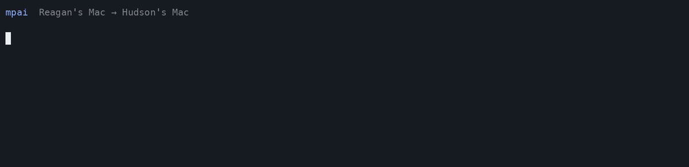

  

<h1 align="center">mpai</h1>

  <strong>Your teammate's AI session. On your terminal.</strong> 
  Make existing Codex and Claude Code work multiplayer without moving the team into a new IDE.

  
  
  
  

  

Real two-Mac receipt · Reagan’s Mac → Hudson’s existing Claude Code session · August 2, 2026

> [!IMPORTANT]
> mpai is a public alpha for trusted teammates on macOS. It uses your existing
> Tailscale network and exposes only sessions the host explicitly shares. Read
> the [current alpha boundary](./docs/PUBLIC-ALPHA.md) before using it with
> sensitive work.

## The idea

Remote control is arriving for AI coding, but it is built primarily for one
person continuing their own work across devices. Teams still have a different
problem: one person can be forty turns deep in a useful Codex or Claude Code
conversation while everyone else gets a summary, a screen share, or a finished
pull request.

mpai adds the missing team layer:

~~~text
$ mpai @maya

  MAYA'S SHARED SESSIONS
  1  Codex         Release hardening             2m
  2  Claude Code   Auth handoff                  18m

  Following: Maya, Alex

  MAYA
  Trace the invite boundary before we cut the alpha.

  CODEX
  I found the shared access check. The direct-read test is missing.

  ALEX → CODEX
  Add the test, then run only the server suite.
~~~

The host keeps using the native agent. The teammate sees the same persisted
context and can add a turn with their own name attached.

## Quickstart

### Requirements

- macOS
- Homebrew, or Node.js 20+ for the fallback install
- Tailscale connected on both Macs
- An authenticated current <code>codex</code> and/or <code>claude</code> CLI

### 1. Host setup

~~~bash
brew install godfaddaai/tap/mpai
mpai setup --name "Your Name"
~~~

Without Homebrew:

~~~bash
npm install --global github:godfaddaai/multiplayer-ai
~~~

<code>mpai setup</code> configures identity, discovers available providers,
installs the background service, and verifies its reachable version.

### 2. Invite a teammate

On Maya's Mac:

~~~bash
mpai invite --name Alex --role participant --share selected
mpai share SESSION_ID --with Alex
~~~

Send the two lines printed by <code>mpai invite</code> to Alex through a channel
you trust. The invite contains a secret. Do not paste it into an issue,
terminal recording, or public chat.

### 3. Teammate joins

On a fresh Alex Mac, no separate setup step is needed:

~~~bash
brew install godfaddaai/tap/mpai
mpai join 'mpai://100.x.y.z:7337/join?token=...'
mpai @maya
~~~

The invite establishes Alex's attributed identity, stores the peer credential
outside config, makes Alex's Mac ready to host in return, checks for shared
sessions, and prints the exact next command.

Testing this with a real teammate? Join the
[first 10-team public-alpha cohort](https://github.com/godfaddaai/multiplayer-ai/issues/7)
and report only privacy-safe timing and outcome metadata.

For a trusted cofounder relationship where both people intentionally share all
present and future sessions:

~~~bash
mpai share all --with Alex
~~~

Return to selected sharing at any time:

~~~bash
mpai unshare all --with Alex
mpai share SESSION_ID --with Alex
~~~

## What works in 0.4.5

- One task and event model across Codex and Claude Code
- Native session discovery and transcript reading
- A live terminal room with named participants
- Exact session switching, search, and reconnect notices
- A ten-second peer connection deadline with actionable wake, Tailscale, and
  host-service recovery instructions
- Attributed remote prompts in supported provider modes
- Viewer and participant roles
- Private-by-default session sharing and invite revocation
- Tailscale identity binding
- macOS Keychain-backed peer credentials with legacy migration and a routed
  mode-0600 fallback for non-interactive hosts where Keychain is unavailable
- One remote turn at a time per task
- Append-only prompt audit trail
- A macOS background service and provider-aware health checks
- Paste-an-invite setup from a fresh install
- Upgrade-stable background-service launchers
- Metadata-only redacted support bundles

## Room commands

~~~text
/sessions        list this teammate's shared sessions
/find auth       search titles and workspaces
/switch 2        follow session 2
/open abc123     follow by session prefix
/who             show named people in this room
/refresh         read the newest native transcript
/leave           return to your shell
~~~

Scriptable commands are available too:

~~~bash
mpai list @maya
mpai show @maya 1234abcd --tail 6
mpai prompt @maya 1234abcd "Check the retry boundary."
mpai audit @maya
~~~

When something breaks, create a reviewable diagnostic without session content
or secrets:

~~~bash
mpai support-bundle
~~~

## How it works

~~~mermaid
flowchart LR
    A["Alex's terminal"] -->|"named prompt"| M["mpai"]
    M -->|"Tailscale identity + invite role"| H["Maya's Mac"]
    H --> C["Native Codex session"]
    H --> D["Native Claude Code session"]
    H -.->|"explicitly shared sessions only"| A
~~~

mpai is a coordination layer above the providers:

~~~text
start → listTasks → readTask → prompt(event stream) → close
~~~

Tasks keep provider-qualified IDs such as <code>codex:&lt;id&gt;</code> and
<code>claude:&lt;id&gt;</code>. The terminal room and peer protocol do not need
provider-specific UI. See [PROVIDERS.md](./docs/PROVIDERS.md).

### Claude Code

mpai reads the local Claude Code CLI session store and uses Claude Code's
supported headless resume path for attributed turns. The teammate input is
persisted as:

~~~text
[Multiplayer teammate: Alex]
The actual prompt
~~~

The alpha targets local Claude Code CLI sessions, not every Claude surface.

### Codex

The strongest mode connects to the managed local Codex daemon so native clients
and mpai can share one app server. If that daemon is absent, mpai can list and
read persisted tasks through a standalone server, but remote prompting is
disabled by default to avoid racing an active Desktop task.

~~~bash
codex app-server daemon bootstrap --remote-control
mpai serve --codex-mode proxy
codex --remote unix://
~~~

## Security, plainly

- The collaboration service listens on the Tailscale address, not every
  interface.
- Network identity comes from Tailscale; authorization comes from an
  identity-bound invite and role.
- New invitations default to selected-session access.
- Unshared titles, transcripts, presence, audit events, and prompt routes stay
  hidden.
- The host stores only a SHA-256 hash of an issued invite token.
- There is no endpoint for arbitrary shell execution, deletion, archival, or
  remote approval delegation.
- Codex remote approvals are declined. Claude remote turns use
  <code>dontAsk</code>, so an operation that needs an interactive permission
  prompt is denied.

Joined-peer bearer tokens live in macOS Keychain when it is available. A
non-interactive macOS session that cannot access Keychain falls back to a
mode-0600 local credential file and records that backend in the peer reference.
Reads follow that per-peer reference. The local config never stores the token
itself; existing inline alpha tokens migrate on first load. Read
[SECURITY.md](./SECURITY.md) for threat boundaries and reporting. The
[privacy notice](./PRIVACY.md) explains local data handling, and the
[acceptable use policy](./ACCEPTABLE_USE.md) states the authorization boundary.

## Alpha limits

This is useful enough to dogfood and early enough to break:

- macOS and an existing tailnet are required.
- Safe Codex prompting depends on the managed-daemon path. Standalone Codex is
  view-only by default.
- The Claude integration targets the local CLI session store.
- Physical sleep/wake recovery and three-person concurrency proof remain open.
- It is not yet certified for 100-person organizations.

Every release gate is tracked in [PUBLIC-ALPHA.md](./docs/PUBLIC-ALPHA.md).
The weighted, evidence-only path to 98/100 is tracked in
[LAUNCH-READINESS.md](./docs/LAUNCH-READINESS.md).

## Development

~~~bash
git clone https://github.com/godfaddaai/multiplayer-ai.git
cd multiplayer-ai
npm install
npm run verify
npm link
mpai doctor
~~~

The local protocol dashboard under <code>src/web/</code> is diagnostic-only.
The product interface is <code>mpai</code> in the terminal.

See [CONTRIBUTING.md](./CONTRIBUTING.md) before opening a pull request.

## Roadmap

- [x] macOS Keychain-backed peer credentials
- [x] One-command Homebrew tap install
- [x] Fresh-install invite bootstrap and upgrade-stable service launcher
- [x] Redacted <code>mpai support-bundle</code>
- [x] Public release-asset upgrade, rollback, and uninstall verification
- [ ] Safe attachment across supported active Codex surfaces
- [ ] Three-person concurrency certification
- [ ] Linux support
- [ ] Provider SDK and additional coding agents
- [ ] Organization directory, RBAC, SSO/SCIM, policy, and audit export

See [UPGRADING.md](./docs/UPGRADING.md) for the current update, rollback, and
uninstall procedures.

## Why this can matter

The bet is not merely that AI coding is large. It is that teams now operate
many powerful single-user agents while context, authorship, and steering remain
fragmented across individual sessions.

The evidence, competitive landscape, bottom-up scenarios, and falsification
tests are documented in [MARKET-THESIS.md](./docs/MARKET-THESIS.md).

## License

[MIT](./LICENSE) © mpai contributors
